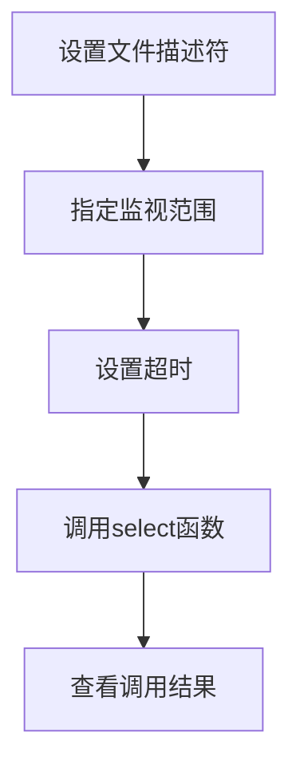

### 9 I/O复用

#### 9.1select系统调用

select系统调用的用途是：在一段时间内，监听用户感兴趣的文件描述符上的可读、可写、和异常事件、

整个一个流程是这样：一整个经过




```
#include<sys/select.h>
int select(int maxfd,fd_set* readfds,fd_set* writefds,fd_set* exceptfds,struct timeval* timeout);
```

（1）maxfd:监视对象的描述符数量。通常设置为监听所有文件描述符中的最大值加1，因为文件描述符是从0开始计数。

（2）reads，writefds，exceptfds参数分别指向可读、可写和异常等事件文件的描述符集合。应用程序调用select调用返回时，内核将修改他们来通知应用程序那些文件描述符已经就绪。

返回的整数就是发生事件的个数。

fd_set是一个结构体，里面就是一个整型数组。该数组的每一位标记一个文件描述符。fd_set能容纳的文件描述符数量由FD_SETSIZE指定。

可使用如下这些函数来访问fd_set数组

```
FD_ZERO(fd_set *fdset);将fd_set变量的所有位都初始化为0
FD_SET(int fd,fd_set* fdset);在参数发的set、指向的变量中注册文件描述符fd信息
FD_CLR(int fd,fd_set* fdset);从fdset中擦除文件描述符fd信息
int FD_ISSET(int fd,fd_set* fdset);若参数fdset指向的变量中包含文件描述符fd信息，则返回真
```

（3）timeout参数用来设置select函数的超过时间。他是一个timeval结构体类型的指针。采用的指针参数是因为内核修改它以告诉应用程序select等待了多久。

```
struct timeval{
	long tv_sec;秒数
	long tv_usec;微妙数
}
```

select成功时返回就绪（可读、可写、异常）文件描述符的总数。如果在超过时间内没有任何文件描述符就绪，select返回0.

##### 9.1.2 文件描述符就绪条件

下面这些情况文件描述符可读：

* socket内核接收内核缓冲区中的字节数大于或等于其低位标记SO_RECCVLOWAT。此时可以通过无阻塞读该socket，并且读操作返回的字节数大于0.
* socket通信的对方关闭连接。此时对该socket的读操作将返回0.
* 监听socket上有新的连接请求
* socket上有未处理的错误。可以使用getsockopt来读取和清除该错误。

下列情况下socket可写：

* socket内核发送缓冲区中的可用字节数大于或等于其低水位标记SO_SNDLOWAT。此时可以无阻塞地写该socket，并且写操作返回的字节数大于0.
* socket的写操作被关闭。对写操作被关闭的socket执行写操作将触发一个SIGPIPE信号。
* socket使用非阻塞connect连接成功或者失败之后。
* socket上有未处理的错误。此时可以使用setsockopt来读取和清除该错误。

##### 9.1.3 处理带外数据

socket上接收普通数据和带外数据都将使select返回，但socket处于不同的就绪状态：前者处于可读状态，后者处于异常状态。

主要就是加上一个判断是不是一个异常状态

```
if(FD_ISSET(connfd,&exception_fds)){
	recv(connfd,buf,sizeof(buf)-1,MSG_OOB);
}
```

#### 9.2 poll系统调用

poll系统调用和select类似，也是在指定时间内轮询一定数量的文件描述符，以测试其中是否有就绪着。poll的原型如下：

```
int poll(struct pollfd* fds,nfds_t nfds,int timeout);
```

1. fd是一个pollfd结构类型的数组，它指定所有我们感兴趣的文件描述符上发生的可读、可写和异常等事件。pollfd结构体如下

```
struct pollfd{
	int fd;文件描述符
	short events;注册的事件
	short revents;实际发生的事件，由内核填充
}
```

events成员告诉poll监听fd上的哪些事件，他是一系列事件的按位或；revents成员则由内核修改，以通知应用程序fd上实际发生了哪些事件。poll支持的事件类型如下


2.nfds参数指定被监听事件集合fds的大小。其类型nfds_t定义如下：

`typedef unsinged long int nfds_t`

3.timeout参数指定poll的超时值，单位是毫秒。当timeout为-1时，poll调用将永远阻塞，知道某个事件发生；当timeout为0时，poll调用将立刻返回。

poll系统调用的返回值的含义与select相同。

#### 9.3 epoll系列系统调用

##### 9.3.1 内核事件表

epoll使用一组函数来完成任务，而不是单个函数。epoll把文件描述符上的事件放到内核里的一个事件表中，从而无须像select和poll那样每次调用都要重复传入文件描述符或事件集。但epoll需要使用一个额外的文件描述符，来唯一标识内核中的这个事件表。这个文教描述符使用epoll_create函数来创建：

```
int epoll_create(int size);
```

size参数不起作用，只是给内核一个提示，告诉事件表需要多大。该函数返回的文件描述符将用作其他所有epoll系统调用的第一个参数，以指定要访问的内核事件表。

用来操作epoll内核事件表

```
int epoll_ctl(int epfd,int op,int fd,struct epoll_event* event);
```

fd参数是要操作的文件描述符，op参数则指定操作类型。操作类型有下面三种

* EPOLL_CTL_ADD,往时间表中注册fd上的事件。
* EPOLL_CTL_MOD：修改fd上的注册事件。
* EPOLL_CTL_DEL：删除fd上的注册事件。

event参数指定事件，它是epoll_event结构指针类型。定义如下

```
struct epoll_event{
	_uint32_t events;//epoll事件
	epoll_data_t data;//用户数据
}
```

event成员描述事件类型。epoll支持的时间类型和poll基本相同。表示epoll事件类型的宏是在poll对应的前面加上E。但epoll有两个额外的事件类型---EPOLLET和EPOLLONSHOT。他们对于epoll的高效运作非常关键（水平触发和边缘触发）。data成员用于保存用户数据。定义如下

```
typedef union epoll_data{
	void * ptr;
	int fd;
	uint32_t u32;
	uint63_t u64;
}epoll_data_t;
```


epoll_ctl成功时返回0，失败时返回-1并设置errno。

##### 9.3.2 epoll_wait函数

epoll系列系统调用的主要接口是epoll_wait函数。它在一段超时时间内等待一组文件描述符上的事件，原型如下：

```C++
int epoll_wait(int epfd,struct epoll_event* events,int maxevents,int timeout);
```

函数成功时返回就绪的文件描述符的个数，失败时返回-1并设置errno。

maxevents参数指定最多监听多少个事件，它必须大于0.

epoll_wait函数如果检测到事件，就将所有就绪事件从内核事件表中（由epfd参数指定）复制到第二个参数events指向的数组中。这个数组只用于输出epoll_wait检测到的就绪事件。而不像select和poll的数组参数那样即用于传入用户注册的事件，又用于输出内核检测到的就绪事件。

因此，极大提高了应用程序索引就绪文件描述符的效率。

```C++

使用poll返回的就绪文件描述符。
int ret=poll(fds,MAX_EVENT_NUMBER,-1);
for(int i=0;i<MAX_EVENT_NUMBER;i++){//必须遍历已注册文件描述符并找到其中的就绪者。
	if(fd[i].revents&POLLIN){
		int sockfd=fd[i].fd;//判断第i个文件描述符是否就绪
		//处理socket
	}
}

下面使用epoll
int ret=epoll_wait(epollfd,events,MAX_EVENT_NUMBER,-1);
for(int i=0;i<ret;i++){//只遍历返回的ret个文件描述符
	int sockfd=event[i].data.fd;//在event中遍历，这里面全都是就绪的文件描述符。就省去了遍历全部注册的
	//文件描述符
}
```

##### 9.3.3 LT和ET模式

LT（level trigger，水平触发）和ET（edge trigger，边缘触发）。LT是默认的工作模式，这种模式下epoll相当于一个效率较高的poll。

当往内核事件表中注册一个文件描述符上的EPOLLET事件时，epoll将以ET模式来操作该文件描述符。ET模式是epoll的高效工作模式。

**LT**：当epoll_wait检测到其上有事件发生并将此事件通知应用程序后，应用程序可以不立即处理该事件。当应用程序下一次调用epoll_wait时，epoll_wait还会再次向应用程序通告此事件。直到该事件被处理。

**ET**:当epoll_wait检测到其上有事件发生并将此事件通知应用程序，应用程序必须立即处理该事件，因为后续的epoll_wait调用将不再向应用程序通知这一事件。

ET模式很大程度上降低了同一个epoll事件被重复触发的次数，因此效率比LT模式高。

代码稍后展示

##### 9.3.4 EPOLLONESHOT

使用ET模式，一个socket上的某个事件还是可能被多次触发。这在并发程序中会引起一个问题。比如一个线程在读取完某个socket上的数据后开始处理这些数据，而在数据处理的过程中该socket上又有新数据可读（EPPOLIN再次被触发），此时另一个线程被唤醒来读取这些新的数据。于是出现了两个线程同时操作一个socket的局面。但是我们只期望一个socket连接在任一时刻都只被一个线程处理。这一点可以使用epoll的EPOLLONESHOT事件实现。


对于注册了EPOLLONESHOT事件的文件描述符，操作系统最多触发其上注册的一个可读、可写、或者异常事件，且只触发一次。除非使用epoll_ctl函数重置该文件描述符上注册的EPOLLONEDHOT事件。这样当一个线程在处理某个socket时，其他线程是不可能有机会操作该socket的。

但是注册了EPOLLONESHOT事件的socket一旦被某个线程处理完毕，该线程就应该立即重置这个socket上的EPOLLONESHOT事件，以确保这个socket下一次可读，其EPOLLIN事件能被触发，进而让其他工作线程有机会继续处理这个socket。

#### 9.4 三组I/O复用函数的比较

这三组系统调用都能同时监听多个文件描述符。他们将等待由timeout参数指定的超过时间，知道一个或者多个文件描述符上有事件发生时返回，返回值是就绪文件描述符的数量。返回0表示没有事件发生。

 这三组函数都通过某种结构体变量来告诉内核监听哪些文件描述符上的哪些事件，并使用该结构体类型的参数来获取内核处理的结果。

* select：select参数类型fd_set没有将文件描述符和事件绑定，仅仅是一个文件描述符的集合。因此select需要提供3个这种类型的参数来分别传入和输出可读、可写及异常等事件。这一方面使得select不能处理更多类型的事件，另一方面由于内核对fd_set集合的在线修改，应用程序下次调用select钱不得不重置这三个fd_set集合
* poll：把文件描述符和事件都定义其中，任何事件都被统一处理，从而使得编程接口简洁得多。并且内核每次修改的是pollfd结构体的revents成员，而events成员保持不变，因此下次调用poll时应用程序无须重置pollfd类型的事件集参数。由于每次select和poll调用都返回整个用户注册的事件集合（其中包括就绪的和未就绪的），所以应用程序索引就绪文件描述符的时间复杂度为o(n)。
* epoll：在内核中维护一个事件表，并提供了一个独立的系统调用epoll_ctl来控制往其中添加、删除、修改事件。这样epoll_wait调用都直接从该内核事件表中取得用户注册的事件，而无须反复从用户空间读入这些事件。epoll_wait系统调用的events参数仅用来返回就绪的事件，这使得应用程序索引就绪文件描述符的事件复杂度为o(1)。。。。个人理解以空间换时间。用额外的表来存放就绪事件，就不用遍历整个事件表。


poll和epoll_wait分别使用nfds和maxevents参数指定最多监听多少个文件描述符和事件。这两个数值都能达到系统允许打开的最大事件描述符数目，即65535（2个字节的大小，一个字节8位，即2的16次方）。而select允许监听最大文件描述符数量有限。


select和poll都只能工作在相对低效的LT模式，而epoll则可以工作在ET高效模式。并且epoll还支持EPOLLONESHOT事件。该事件能进一步减少可读、可写和异常等事件被触发的次数。


**从原理上看**

select和poll采用的都是轮询的方式，每次调用都要扫描整个注册的文件描述符集合，并将其中就绪的文件描述符返回给用户程序，因此他们检测的就绪事件算法时间复杂度是O(n).epoll_wait则不同，他采用回调的方式。内核检测到就绪的文件描述符时，将触发回调函数，回调函数将该文件描述符上对应的事件插入内核就绪事件队列。内核最后在适当的时机将就绪事件队列中的内容拷贝到用户空间。因此epoll_wait无须轮询整个文件描述符集合来检测哪些事件已经就绪，其事件复杂度为o(1).

**但是**当活动连接比较多的时候，epoll_wait效率未必比select和poll高，因此此时回调函数被触发得过于频繁。所以epoll_wait适用于连接数量多，但活动连接较少的情况


下面是一个总结。


